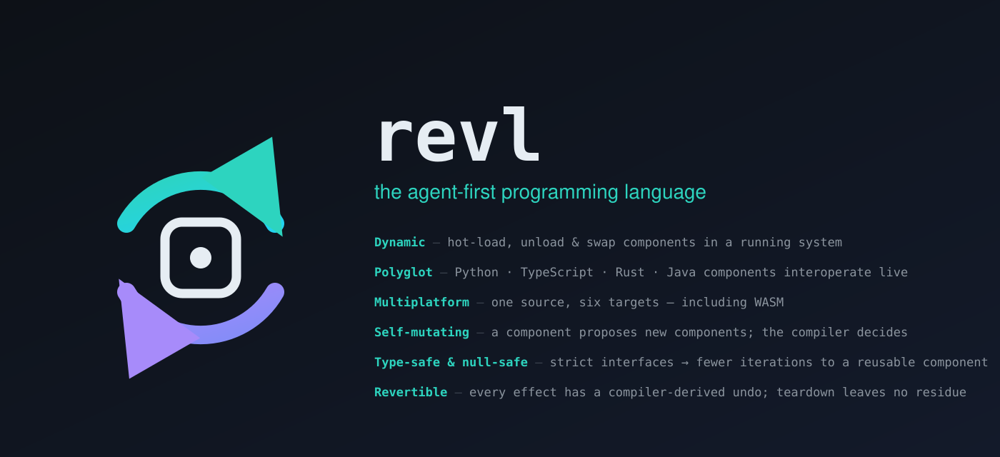
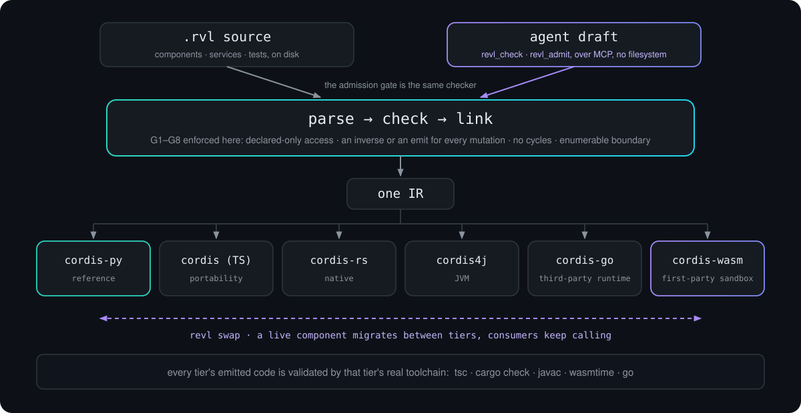

<div align="center">



<p>
  <a href="https://github.com/inso1337/revl/actions/workflows/ci.yml"></a>
  
  
  
  
  
</p>

<p>
  <b><a href="#quickstart">Quickstart</a></b> ·
  <a href="#architecture">Architecture</a> ·
  <a href="#documentation">Documentation</a> ·
  <a href="DESIGN.md">Design</a> ·
  <a href="docs/vision.md">Vision</a> ·
  <a href="docs/guide-ai-agents.md">For agents</a>
</p>

</div>

---

A research language for **spatiotemporal composability**: components that can
be loaded, unloaded, and hot-swapped in a running system, where "unloading
leaves no residue" and "dependencies stay coherent" are **compile-time
guarantees**, not runtime discipline.

revl is the language-level realization of the paradigm formalized in
[*A Programming Paradigm for Spatiotemporal Composability*](https://github.com/cordiverse/paper)
and implemented as a library by [Cordis](https://github.com/cordiverse/cordis).
The one-line pitch: **Cordis has revertible effects as a discipline; revl makes
them a type system**, the same jump C++ RAII made to become Rust's ownership.
What this is *for* (and the honest scope of the "future of programming" claim)
is [docs/vision.md](docs/vision.md).

```revl
service Database {
  emission fn execute(sql: Str) -> Int    // crosses the system boundary
}

service Cache {
  fn get(key: Str) -> Opt[Str]
  emission fn put(key: Str, value: Str)   // its body emits, so the interface says so
}

component UserCache requires db: Database provides cache: Cache {
  let store = effect Map.new() undo store.drop()

  provide cache {
    fn get(key) = store.get(key)
    fn put(key, value) {
      effect store.insert(key, value)
      undo   store.remove(key)
      emit db.execute(`INSERT INTO cache_log VALUES (${key})`)
    }
  }
}
```

## Architecture

<div align="center">



</div>

One front-end parses, checks and links `.rvl` source into a single IR, enforcing
guarantees **G1–G8** before any code is emitted. Six emitters lower that one IR
to six runtimes, and the same compiler runs behind an MCP server, so an AI
agent proposing a component talks to the *admission gate*, not the filesystem.
The claim that all six tiers agree is not asserted; it is
[measured](docs/conformance.md), by handing each emitter's output to that tier's
real compiler.

- Undeclared access won't compile. Mutations without an inverse (or an
  explicit `emit` admission of irreversibility) won't compile. Dependency
  cycles and provision conflicts are rejected at link time. Teardown cannot
  register effects, by construction.
- **Type-safe and null-safe.** Bidirectional checking, sound where declared:
  service and function call sites are checked against their signatures,
  provide-methods inherit the service's types (surface names, service
  signature), and returns are verified. There is no `null` in the type
  system. Absence is `Opt[T]`; `T` flows into `Opt[T]` but never silently
  back out, and the diagnostic says to unwrap with `match` or `??`. The
  unchecked remainder is enumerated, not implied: host-valued objects and
  the extern boundary, both on the G8 audit surface.
- **Agent-native.** `revl mcp serve` runs the compiler as an MCP server, so
  an agent proposing a component gets `revl_check` / `revl_admit` (the
  admission gate) instead of filesystem access, and rejections come back as
  structured diagnostics (code, guarantee, expected/actual, fix hint);
  `revl compile --json-diagnostics` surfaces the same for humans and CI. `revl mcp schema`
  projects a composition's services to MCP tools whose `readOnlyHint` /
  `destructiveHint` are **derived from the compiler**, including from the
  method body, so a tool cannot describe itself as harmless when it emits.
  See [docs/mcp-bridge.md](docs/mcp-bridge.md).
- **Conformance is measured, not asserted.** `tools/conformance.py` emits 50
  language constructs through all six backends and reports what each does;
  `docs/conformance.md` records the result and separates a *deliberate* tier
  limit (an extern with no body for that backend; `Str` on the i32-only wasm
  tier) from a real gap; every gap in *emitting* is closed. `--validate`
  asks the second question: it hands each tier's output to that tier's real
  compiler (`tsc`, `cargo check`, `javac`, `wasmtime`, and a scope walk for
  python), because "the emitter did not raise" never implied "the code
  compiles": that gap hid a rust bug for months, a TypeScript twin of it, and
  16 cases that emit code their own compiler rejects (13 java, 3 rust).
  python, typescript and wasm validate clean; the rest are baselined in
  `tests/test_conformance_validate.py`, which fails on new breakage *and* on
  a baselined case that starts passing, so the list can only shrink. Each
  tier's validator skips loudly when its toolchain is missing, and two of
  them are missing in CI: the job that runs this suite installs neither
  `backends/typescript/node_modules` nor `wasmtime`, so the *typescript* and
  *wasm* halves of "validates clean" are reproducible locally
  (`pytest tests/test_conformance_validate.py -q -rs`, with `npm ci` and
  `wasmtime` present) but are **not** gated on every push.
- Backends: [cordis-py](https://github.com/geohotstan/cordis-py) (reference),
  [cordis](https://github.com/cordiverse/cordis) (TypeScript), the
  cordis-wasm substrate, [cordis-rs](https://docs.rs/cordis-rs)
  (Rust), [cordis4j](https://github.com/1na-ko/cordis4j) (Java), and
  [cordis-go](https://github.com/0xdenny218/stc-go) (Go, targeting the
  third-party stc-go runtime).
  One language, six tiers ([docs/vision.md](docs/vision.md)). See
  [DESIGN.md](DESIGN.md) for the full design, the checked-guarantees table,
  and why raw native codegen is deliberately a non-goal.

**Status: v1.** The pipeline runs end-to-end on **six backends**:
**cordis-py** (reference), **cordis** (TS), the **cordis-wasm substrate**
([backends/wasm/](backends/wasm/)), **cordis-rs** (Rust), **cordis4j** (Java),
and **cordis-go** (Go) ([docs/v2.0-roadmap.md](docs/v2.0-roadmap.md)).
`python -m revl compile` takes `.rvl` sources through parse → check →
link → IR ([docs/backend-ir-v1.md](docs/backend-ir-v1.md)), and the
emitters produce runnable components. On the wasm substrate, confinement is
enforced by the sandbox and `effect/undo` compiles to a state machine with
physical partial rollback. Divert-during-`await` (A1) is *executed* on
cordis-py
(`backends/python/tests/test_v1_semantics.py::test_a1_divert_during_await_skips_emission`)
and checked *structurally* on wasm: the golden asserts the post-`await`
effect is a separate segment a divert can skip
(`tests/test_wasm_backend.py::test_pulse_await_lowering`). The TypeScript
tier's runtime has the in-flight window for it but **no divert test yet**;
that is a gap, not a guarantee. `python -m revl audit` prints a
composition's manifest and G8 boundary surface; `compile_files(...,
manifest=running)` is the runtime-admission gate. The rejection suite in
[examples/rejections/](examples/rejections/) is the checker's executable
spec, and [demo/](demo/) is a live file-watching hot-swap loop: edit a
`.rvl`, watch the running system recompile and swap it. The 2.0 language
below builds on this frozen core.

**Status: 2.0.** The full language of
[docs/syntax-2.0.md](docs/syntax-2.0.md) is implemented on top of the v1
core: a TypeScript-subset stratum of pure functions (`fn`, `var`/`while`/
`for-of` local mutation, arrow lambdas with by-value capture), types and
ADTs with exhaustiveness-checked `match`, modules (`use`/`pub`), template
strings (replacing 1.x `$name` interpolation, the compiler rejects the old
form with a migration hint), `extern` host blocks with typed boundaries on
the G8 audit surface, in-file `test` blocks, realms & interception
(`isolate`/`intercept`, [docs/design-v2-realms.md](docs/design-v2-realms.md)),
and a specified [stdlib surface](docs/stdlib-2.0.md): unknown methods are
compile errors, never host pass-throughs. The strata compose: components
call functions at every expression position, and the audit surfaces host
code transitively. The expression layer is **type-safe and null-safe**
(see above); the remaining typing frontier and everything else in flight
is tracked in the [2.0 roadmap](docs/v2.0-roadmap.md).

**Status: self-hosting.** revl compiles itself natively. `selfhost/compile.rvl`
composes a revl-native pipeline, `admit_src → lower_to_ir → emit_{py,rust}_src`,
and compiles both function programs and component/extern programs to output that
is byte-identical to the reference compiler, with no reference anywhere in the
chain, on py and rust (the function corpus plus the item-262 component/extern
corpus: 15 function cases and 14 component/extern cases). `selfhost/lower.rvl`
produces the complete interchange IR natively (functions, components, externs),
byte-exact against the reference lowerer. The self-hosted stages, lexer, parser,
checker, lowering, and all six tier emitters
(`emit_{py,rust,ts,java,wasm,go}.rvl`, each cross-checked byte-for-byte against
its reference), live in [selfhost/](selfhost/). The point is a differential
oracle: two independent implementations of one grammar, each a check on the
other. What remains is native-tier runtime performance and per-tier run
coverage ([2.0 roadmap](docs/v2.0-roadmap.md) items 283/284), not the
self-hosting question, which is settled.

**Language additions on the frozen core.** Each is a separate spec-then-code
step with its own reference; the entry points below index them.

| addition | one line | docs |
|---|---|---|
| **code-point `Str`** | a `Str`'s unit is a Unicode scalar; `charAt`/`length`/`slice` agree across tiers | [strings.md](docs/strings.md) |
| **`Int32`** | 32-bit two's-complement integers whose `+ - *` **trap** on overflow, with `to_int`/`to_int32` width conversions | [arithmetic.md §Sized integers](docs/arithmetic.md) |
| **`verified effect`** | an `effect … undo …` whose inverse is round-trip tested N times, not merely trusted | [verified-effect.md](docs/verified-effect.md) |
| **`prop test`** | property tests with generators derived from parameter types | [prop-test.md](docs/prop-test.md) |
| **`ns::` namespacing** | namespaced provision keys so a registry can wire two components without key collisions | [namespacing.md](docs/namespacing.md) |
| **sorted `Map`** | `keys()`/`size()`/`remove()` iterate in canonical `Str` order on all six tiers, order is a function of the key set, never of history | [collections.md](docs/collections.md) |
| **functional record update** | `{r \| f = e}` yields a fresh record with `f` replaced (python + typescript emitters) | [records.md](docs/records.md) |
| **block-bodied match arms** | `Case => { … }`, parsed and typechecked; emitters deferred (a fence, see the doc) | [records.md](docs/records.md) |
| **typed holes & fill-specs** | `hole[T]` type-checks, is reported as an obligation with an expected-type fill spec, and can never be admitted | [holes.md](docs/holes.md) |
| **realm erasure** | `revl erase-report --realm R`, right-to-erasure evidence as a compiler artifact | [erase-report.md](docs/erase-report.md) |
| **WIT bridge** | `revl import wit` / `revl export wit`, a revl service is a Wasm-component interface, both directions | [wit-bridge.md](docs/wit-bridge.md) |
| **the component registry** | `revl_resolve`, find an admission-compatible component to import instead of regenerating one | [registry.md](docs/registry.md) |
| **timers: `every` / `after`** | a timer is a revertible schedule, its inverse is cancellation, derived teardown; the clock is a coeffect, and the `advance` lifecycle statement makes firings assertable steps | [time-coeffect.md](docs/time-coeffect.md) |
| **async: `Async[T]` + `async` externs** | asynchrony is a declared property, like emission-ness: async function values with coloring checked (A1), async host ops awaited on py/ts and erased on go/rust | [design/async-extern.md](docs/design/async-extern.md) |
| **`handoff`, verified state hand-off** | a hot-swap of a stateful provider carries its state: the shape is declared, checked at admission (the §5 relation pointed at state), and drift is refused | [state-handoff.md](docs/state-handoff.md) |
| **capability attenuation on `spawn`** | a spawn may narrow a child's capabilities, never widen, least authority per instance, checked | [capability-attenuation.md](docs/capability-attenuation.md) |
| **stdlib JSON** | `json_parse` / `json_stringify` over Str/Int/Bool/Float/List/Opt/records, structured tool args without a hand-rolled wire format | [stdlib-json.md](docs/stdlib-json.md) |

## The toolchain is the developer surface

revl treats its author, increasingly an AI agent, as a first-class user, so
the compiler exposes far more than *compile / don't compile*. Each of these is
reachable from the CLI and, where it makes sense, as an MCP tool.

| capability | what it answers | docs |
|---|---|---|
| **`revl plan`** | *before* a hot-swap: which provisions appear/withdraw, which running components get diverted, teardown order, how the emission surface changes | [plan.md](docs/plan.md) |
| **`revl query`** | who emits to `X`? what breaks if I withdraw `C`? what does a component reach? Each result says whether it is exact or a conservative over-approximation | [queries.md](docs/queries.md) |
| **Typed holes** | `hole[T]` type-checks so the rest of a draft still checks, is reported as an obligation, and can never be admitted or emitted | [holes.md](docs/holes.md) |
| **Backwards replay** | step an activation back over its own accumulator; R4 no-residue survives the round-trip. Only the revertible-effect model makes this cheap | [replay.md](docs/replay.md) |
| **Capability-scoped emissions** | `emission[db]` bounds *which* boundary a provider may cross, not just whether it emits, a tighter contract for agent-authored code | [capabilities.md](docs/capabilities.md) |
| **Why-traces** | a G2/G3/G4 rejection ships the derivation, not just the verdict (`put → writeThrough → audit.log`); `revl explain <code>` prints the fix | [why-traces.md](docs/why-traces.md) |
| **Fault tests** | `fault test "…" for Component { fail at step 2; assert no residue }`, the paradigm's L-Raise guarantee as a declarable assertion | [fault-tests.md](docs/fault-tests.md) |
| **Lifecycle tests** | `lifecycle test`, assert no-residue over a *live* composition from inside the language | [syntax-2.0.md](docs/syntax-2.0.md) §7.1 |
| **Function types** | `(Int, Str) -> Bool`, arrows leave the unchecked frontier where a type is known | [function-types.md](docs/function-types.md) |
| **Importers** | `revl import openapi` / `revl import wit`, an external contract becomes a typed service | [import-openapi.md](docs/import-openapi.md) · [import-wit.md](docs/import-wit.md) |
| **MCP server** | `revl mcp serve`, the whole compiler as an agent admission gate; `revl mcp schema` derives tool safety hints from the *body* | [mcp-bridge.md](docs/mcp-bridge.md) |
| **truc** | the component manager, written in revl: `add` / `rm` / `assemble` (`--check` dry run) / `ship`, every fetched component is admitted through the gate before it joins the assembly | [truc.md](docs/truc.md) |
| **quarantine tier** | the gauntlet proves a candidate *runs correctly*; quarantine proves it *cannot escape while doing so*, in the wasm sandbox, trap-on-escape, before any hosted tier | [quarantine-tier.md](docs/quarantine-tier.md) |
| **`revl canary`** | progressive delivery over realms: the successor takes a designated slice, promote or revert on evidence, the rollback is derived | [verified-canary.md](docs/verified-canary.md) |
| **`revl repair`** | fault → diagnose → re-admit, inside declared bounds; stops for a human exactly where policy says it must | [repair-loop.md](docs/repair-loop.md) |
| **operator capabilities** | G4 for the management plane: an operator profile gates which MCP verbs a session may reach | [operator-capabilities.md](docs/operator-capabilities.md) |
| **network placement** | a placement seam names `host:port`, the same proxy/stub wiring and reactive withdrawal, across machines | [network-placement.md](docs/network-placement.md) |
| **parallel activation** | boot scales with the dependency graph's depth, not the composition's size | [parallel-activation.md](docs/parallel-activation.md) |
| **the token economy** | tokens-to-green is a committed metric, and `revl_ship` is one compound check+admit+publish verb | [token-economy.md](docs/token-economy.md) |

## Command & MCP-verb reference

Every subcommand wired in `src/revl/__main__.py`, one line each. The complete
per-command flag reference is [docs/commands-reference.md](docs/commands-reference.md);
the verb-by-verb MCP reference is [docs/mcp-reference.md](docs/mcp-reference.md).

| command | what it does | docs |
|---|---|---|
| `revl compile FILES [-o OUT]` | parse → check → link → IR; `--json-diagnostics` for CI | [commands-reference.md](docs/commands-reference.md#revl-compile) · [backend-ir-v1.md](docs/backend-ir-v1.md) |
| `revl explain CODE` | what a diagnostic code guarantees and the fix | [commands-reference.md](docs/commands-reference.md#revl-explain) · [why-traces.md](docs/why-traces.md) |
| `revl doctor` | diagnose each backend tier, runtime and dependency (OK/WARN/MISSING + version), then smoke-test every available tier; `--json`, `--no-smoke` | [commands-reference.md](docs/commands-reference.md#revl-doctor) |
| `revl scaffold --service NAME` | generate a typed, holed composition skeleton from a spec (`--requires`/`--capabilities`/`--method`/`--emits`, `--json`) | [scaffold.md](docs/scaffold.md) |
| `revl audit FILES` | composition manifest + G8 boundary surface (`--json`); `--diff PREV.json` is the authority-drift gate (`--accept`/`--accept-all`) | [interchange-format.md](docs/interchange-format.md) · [audit-diff.md](docs/audit-diff.md) |
| `revl diff PREV CURR` | semantic composition diff: components added/removed/changed, emissions gained/lost, provide/require edges, the PR-review tool for agent-generated compositions | [revl-diff.md](docs/revl-diff.md) |
| `revl version PREV CURR` | derive the required semver bump from the interface diff against a previous composition | [derived-versioning.md](docs/derived-versioning.md) |
| `revl contract FILES` | federated contracts between sovereign compositions: export a consumer surface, or check a provider against a pinned one | [federation.md](docs/federation.md) |
| `revl erase-report FILES --realm R` | right-to-erasure evidence for one realm (no-residue proof, crossings, other realms untouched) | [erase-report.md](docs/erase-report.md) |
| `revl undo --history H` | operator undo: replay a generation history and return to an earlier generation *through the gate* | [generation-history.md](docs/generation-history.md) |
| `revl metrics --trace FILE` | capability-aware runtime metrics over a `run --trace` JSONL: emissions by capability, failures by G-rule, average lifecycle duration | [revl-metrics.md](docs/revl-metrics.md) |
| `revl profile --trace FILE` | diff a component's *declared* emission surface against what a run actually emitted, flagging over-declaration | [revl-profile.md](docs/revl-profile.md) |
| `revl attest FILES` | sign a portable record that this exact composition was admitted (canonical IR hash + verdict + guarantees + timestamp); `--verify` checks one | [revl-attest.md](docs/revl-attest.md) |
| `revl dash` | the supervisor's cockpit: a read-only live view over a session or recorded run, the dependency graph, causal trace, and pending-decisions queue | [dash.md](docs/dash.md) |
| `revl plan FILES [-o change.plan]` | dry run for a hot-swap; `-o` writes an executable plan artifact | [plan.md](docs/plan.md) |
| `revl apply change.plan` | execute a plan against a live composition: drift-refuse, verify each step, roll back on failure | [apply.md](docs/apply.md) |
| `revl query SUB …` | `emits-to`/`withdraw`/`depends-on`/`reaches`/`drift` over source; `emitted-between`/`touched` over a recorded run | [queries.md](docs/queries.md) |
| `revl fmt FILES` | canonical formatting (IR-equivalence gated); `--migrate` rewrites 1.x `$` interpolation; `--check` for CI | [fmt.md](docs/fmt.md) |
| `revl test FILES` | run in-file `test`/`prop test`/`fault test`/`lifecycle test` blocks; `--backend {py,ts,rust,java,wasm,go,all}`, `--sweep` fault sweep | [prop-test.md](docs/prop-test.md) · [fault-tests.md](docs/fault-tests.md) |
| `revl run FILES` | boot on a Cordis runtime; `--backend {py,ts,rust,java,wasm,go}` all boot live (py in-process, the rest each a separate process), `--once`, `--watch`, `--record`, `--wal`, `--trace`, `--withdraw`, `--placement`, `--plan` | [replay.md](docs/replay.md) · [crash-recovery.md](docs/crash-recovery.md) |
| `revl recover --wal FILE` | crash recovery: roll a write-ahead log forward or back to a checked verdict + residue proof | [crash-recovery.md](docs/crash-recovery.md) |
| `revl why COMPONENT --trace FILE` | explain a recorded lifecycle transition's cause chain; `--check` runs the withdraw oracle | [why-runtime.md](docs/why-runtime.md) |
| `revl truc VERB …` | the component manager namespaced under the compiler, `add`/`rm`/`assemble`/`ship`/`reproduce`, forwarded as-is | [truc.md](docs/truc.md) |
| `revl quarantine FILES [--service NAME] [--policy POLICY]` | run a candidate's battery inside the wasm sandbox, prove it cannot escape before admission | [quarantine-tier.md](docs/quarantine-tier.md) |
| `revl canary FILES --candidate FILE --slice REALM` | run both generations at once, successor on one realm slice; promote (`--promote-to`) or revert on evidence | [verified-canary.md](docs/verified-canary.md) |
| `revl repair --component C [--candidate FILE] [--plan]` | the repair loop: diagnose a fault and re-admit a fix within declared policy bounds | [repair-loop.md](docs/repair-loop.md) |
| `revl serve --mcp FILES` | serve a booted composition's **own** provided operations as MCP tools | [mcp-bridge.md](docs/mcp-bridge.md) |
| `revl mcp serve` | the compiler itself as an MCP server; `--restore SNAPSHOT.json` re-admits an evolved session | [mcp-bridge.md](docs/mcp-bridge.md) |
| `revl mcp schema FILES` | project provided services to MCP tool definitions | [mcp-bridge.md](docs/mcp-bridge.md) |
| `revl mcp import MANIFEST` | turn an MCP `tools/list` manifest into revl source | [mcp-bridge.md](docs/mcp-bridge.md) |
| `revl import {wit,openapi,cordis}` | import an external interface definition as typed revl source | [import-wit.md](docs/import-wit.md) · [import-openapi.md](docs/import-openapi.md) · [import-cordis.md](docs/import-cordis.md) |
| `revl export wit` | generate the standard WIT interface for a revl service or composition | [wit-bridge.md](docs/wit-bridge.md) |

Two interactive surfaces are not top-level subcommands: `run --record` opens a
replay REPL (`:timeline`, `:back`, `:forward`, `:inspect`, `:bisect`; see
[replay.md](docs/replay.md)), and `run --placement` opens a `swap>` prompt whose
`swap <component> --to <backend>` migrates a live component across tiers
([swap.md](docs/swap.md)).

Two module entry points sit outside the `revl` subcommand tree. `python -m
revl.lsp` runs the human-facing language server over stdio: it pushes
`textDocument/publishDiagnostics` from the checker, answers `textDocument/hover`
from the diagnostic explanations and symbol info, and answers
`textDocument/definition` from the resolver, reusing the compiler surfaces
read-only (`src/revl/lsp/`). `python -m revl.otel run.jsonl` exports a `revl run
--trace` lifecycle trace to OpenTelemetry spans, events and links (a lifecycle
transition is a span, its cause an event, a causal edge a link), so a
composition's causality shows up in Grafana, Datadog, Honeycomb or Jaeger; the
OTel SDK is the optional `revl[otel]` extra, and `--json` prints the span model
without it. See [docs/opentelemetry.md](docs/opentelemetry.md).

**MCP verbs** (`revl mcp serve`), the definitive advertised set (36 verbs) from
`src/revl/mcp/server.py` and `query_tools.py`. Per-verb inputs and outputs:
[docs/mcp-reference.md](docs/mcp-reference.md); full shapes:
[docs/mcp-bridge.md](docs/mcp-bridge.md); agent workflow:
[docs/guide-ai-agents.md](docs/guide-ai-agents.md).

| verb(s) | what they answer | docs |
|---|---|---|
| `revl_check` · `revl_admit` · `revl_plan` | does it compile? may it enter **this** running composition? what would the swap do? | [mcp-bridge.md](docs/mcp-bridge.md) · [plan.md](docs/plan.md) |
| `revl_audit` · `revl_tools` · `revl_grammar` | the G8 surface, the projected tool set, the prompt-sized language surface | [mcp-bridge.md](docs/mcp-bridge.md) |
| `revl_load` · `revl_call` · `revl_state` · `revl_unload` | boot in memory, call an operation, inspect, tear down + prove no residue | [mcp-bridge.md](docs/mcp-bridge.md) |
| `revl_swap` · `revl_edit` · `revl_rollback` | swap a generation, patch server-side source with deltas, undo | [mcp-bridge.md](docs/mcp-bridge.md) |
| `revl_gauntlet` | grade a candidate, a verdict dossier from an isolated battery run | [gauntlet.md](docs/gauntlet.md) |
| `revl_quarantine` · `revl_canary` · `revl_repair` · `revl_ship` | prove a candidate in the sandbox, canary it onto a realm slice, run the repair loop, or check+admit+publish in one compound verb | [quarantine-tier.md](docs/quarantine-tier.md) · [verified-canary.md](docs/verified-canary.md) · [repair-loop.md](docs/repair-loop.md) · [token-economy.md](docs/token-economy.md) |
| `revl_resolve` | find an admission-compatible component to import | [registry.md](docs/registry.md) |
| `revl_snapshot` · `revl_restore` | capture / re-admit an evolved composition across a restart | [persistence.md](docs/persistence.md) |
| `revl_timeline` · `revl_inspect_step` · `revl_step_back` · `revl_replay_bisect` · `revl_replay_forward` | walk, inspect, unwind, binary-search and re-run a recorded accumulator | [replay.md](docs/replay.md) |
| `revl_query_*` (`emitters`/`withdraw`/`dependents`/`reach`/`drift`) · `revl_live_query` | the five query verbs over source, or answered against the live session | [queries.md](docs/queries.md) |
| `revl_history_emitted_between` · `revl_history_lifetime` | the query envelope over a recorded run | [queries.md](docs/queries.md) |

## Interoperability

revl components built for *different* runtimes compose in **one running
system**, across process boundaries: a Python component can require a service
a Rust component provides, and neither shares an address space. `revl run
--placement` spreads a composition over per-tier processes and wires each seam
with a generated proxy/stub pair.

- **Five of the six tiers are symmetric and reactive on the bridge.** `py ↔
  node (TypeScript) ↔ rust ↔ java ↔ go` compose in one lifecycle: every tier
  both *consumes* and *serves*
  across a seam, and every tier turns a provider's death into a reactive
  withdrawal (R2/R3) rather than an exception. Verified end-to-end with `revl
  run --placement … --once`, including a Go↔Python round-trip whose values are
  byte-compatible on the wire, and a Go consumer that withdraws reactively when
  its provider is killed (`tests/test_placement_go.py`). (Java is reactive on a
  real JDK 21 runtime, a stub otherwise. **wasm** is the one tier still outside
  the bridge: it is sandboxed, with its own confinement model.)
- **Values cross by construction, not by a wire schema.** A revl value is a
  record / ADT / `Opt[T]`, value semantics, no object identity, no cycles, so
  it serializes across a seam without a marshalling spec. A service that would
  need shared memory (an address-space-bound host object) is a **checked**
  verdict: `revl audit` (G8) refuses it *at the seam* rather than silently
  marshalling something that cannot cross.

See [docs/interop-bridge.md](docs/interop-bridge.md) for the transport tier,
the trust model, and the distributability audit.

### Turing-complete, demonstrated by execution

2.0's pure stratum is Turing-complete (`var` + `while` + recursion), and the
claim is checked by running the emitted code, not by argument. The gate is
`backends/wasm/test_v3_emit.py::test_v3_loops_run_on_wasmtime`: it compiles
revl sources for `fib` (loop form) and the Collatz step-counter, hands the
emitted module to **real wasmtime**, and asserts `fib(10) = 55`,
`fib(20) = 6765` and `collatz(27) = 111`.

```bash
pytest backends/wasm/test_v3_emit.py -q      # needs wasmtime on PATH; CI pins v47.0.3
```

Recursion executes on the same substrate
(`tests/test_wasm_backend.py`, recursive `fib(10) = 55`). Loops, `for-of`,
mutation and destructuring execute through the **emitted Python** in
`tests/test_v2_emit.py::test_loops_mutation_and_destructuring_emit_and_execute`,
but no test runs *these two programs* through the python or typescript
emitters, so treat wasmtime as the one that proves it.

**Suites.** Each is listed with the command that counts it, because a number
with no command behind it is the failure mode this project keeps hitting:

| suite | command | collected |
|---|---|---|
| frontend (typing, strata, stdlib, MCP-session, self-evolution, cross-tier, emitted-code validation, self-hosted lexer/parser/checker/emitters + native compile, plan/queries/holes/replay/capabilities/why-traces/fault-tests/lifecycle) | `pytest tests/ -q` | 3896 |
| wasm tier | `pytest tests/test_wasm_backend.py backends/wasm/test_v3_emit.py -q` | 42 |
| java tier | `pytest backends/java/test_emit_java.py -q` | 29 |
| rust tier | `pytest backends/rust/test_emit_rust.py -q` | 26 |
| python tier | `sh backends/python/setup.sh && cd backends/python && .venv/bin/pytest -q` | 21 |
| typescript tier | `cd backends/typescript && npm ci && npx vitest run` | not counted here |

Plus the live hot-swap demo, the self-evolution demo and the cordisc
cross-check. **Read the skips.** Most suites skip rather than fail when a
toolchain is absent, and a skip is not a pass: of the 42 wasm-tier tests, 20
execute on real `wasmtime` and skip without it; the java tier skips 8 without
a JDK; the rust cargo tests need crates.io reachable; the cordis-py runtime
tests skip without `backends/python/setup.sh`. The python tier is the
exception, without its own venv it *errors* at collection rather than
skipping, so run it the way the table says.

Three things in that list are **local-only checks, not CI gates**, because
the job that runs `tests/` installs neither cordis-py nor
`backends/typescript/node_modules`: the self-evolution demo
(`tests/test_self_evolution.py`), the live MCP session
(`tests/test_mcp_session.py`), and the cordisc cross-check
(`tests/test_cordisc_crosscheck.py`, which needs cordisc checked out beside
this repo). They pass on a fully-provisioned machine; they skip on every
push. `pytest tests/ -q -rs` prints exactly which.

### The acceptance benchmark (syntax-2.0 §10)

The 2.0 syntax ships only if models actually write it better: the
prescription is 30 component specs × {1.x, 2.0, 2.0+host-blocks} × models,
measuring first-pass compile rate and iterations-to-green against the real
checker. The harness lives in [bench/](bench/) (`python3 bench/run.py`),
generations and summaries are committed under `bench/results/`.

<!-- BENCH-RESULTS:BEGIN -->
Two full 30×3 runs with DeepSeek V4 Pro (3-iteration error-feedback loop,
~$0.25 total): one scored against the **typing-enforced** checker
(`37bed37`), one against the pre-typing checker (`9a8c670`) as a control.
Those as-run numbers are frozen in each run's `summary.md`:

| variant | v1 | v2 | v2host |
|---|---|---|---|
| typed (`bench/results/typed-deepseek-v4-pro`) | 27/30 | 20/30 | 18/30 |
| pre-typing control (`bench/results/baseline-deepseek-v4-pro`) | 28/30 | 17/30 | 13/30 |

Sound typing cost models nothing (typed first-pass is equal-or-better, within
run-to-run variance on n=30). One grammar friction dominated the v2/v2host
gap: models write the full provide-method signature
(`fn query(sql: Str) -> Int = ...`) exactly as the `fn` stratum teaches them
to, and the component grammar rejected those annotations. That friction is
fixed (A6: optional provide-method parameter and return-type annotations,
checked against the service signature).

**Re-score against the current compiler.** `bench/rescore.py` recompiles the
committed `attempt-1.rvl` files, *the same generations, a newer compiler; not
a fresh model run, and it calls no provider*, and reports a failure taxonomy:

```bash
python3 bench/rescore.py --run all      # measured at compiler d71c689
```

| variant | as-run | re-score @ `d71c689` |
|---|---|---|
| v1 | 27/30 | 22/30 |
| v2 | 20/30 | 23/30 |
| v2host | 18/30 | 23/30 |

**The re-score is lower than the as-run number, and that is the honest
result.** The A6 fix alone took all three variants to 28/29/29 (measurable:
`python3 bench/rescore.py --run all --compiler-root <export of 056539f>`).
Landing G4's *upper-bound* direction, a service operation declared plain `fn`
may not be implemented by a body that reaches an emission, then took 18 of
the 90 cells red. Those 18 are not model errors: six specs pinned an interface
declaring `fn put(...)` plain while the brief instructed the model to emit
inside it, so under the new rule the spec was unsatisfiable and the prompts
never taught the rule anyway. Both are fixed for the next run (the seven
affected `specs.json` interfaces now say `emission fn`; all three prompts now
state the upper-bound direction), but fixing them cannot retroactively change
generations produced before the rule existed.

The remaining 4 failures are genuine model errors: an invented stdlib method
(`take` on `Str`) and `29-mesh`, where every variant wrote a bare `kv.put(k, v)`
in statement position, legal only as `let _ = kv.put(k, v)`, a form the
prompts did not mention and now do.

**A fresh model run is what would move these numbers, and it has not been
done since the rule landed.** Treat the re-score as a regression measurement
of the corpus, not as a current model capability figure.

**Fresh run: gpt-oss-20b, local, free, one-shot (2026-08-26).** `bench/run.py`
gained a `local` runner (`--runner local`, stdlib `urllib` only, no new
dependency) that posts straight to an OpenAI-compatible `/chat/completions`
endpoint, for benchmarking local models without a paid provider or the cline
CLI. This run used LM Studio serving `openai/gpt-oss-20b` at
`http://localhost:1234/v1`, all 30 specs, all 3 variants, `--max-iters 1`
(one shot, no retry loop), compiler at `c78f2bc`:
`bench/results/gpt-oss-20b-oneshot/`.

| variant | specs | first-pass compile |
|---|---|---|
| v1 | 30 | 24/30 (80%) |
| v2 | 30 | 24/30 (80%) |
| v2host | 30 | 18/30 (60%) |

All 90 cells got a real response from the model (0 runner errors); every
failure is a genuine compiler rejection, in
`bench/results/gpt-oss-20b-oneshot/results.jsonl` alongside the extracted
`.rvl` per cell.

For comparison, DeepSeek V4 Pro's first-pass rate on the same metric, specs
01-24 (`bench/results/rerun-deepseek-v4-pro-20260826/`): v1 96%, v2 96%,
v2host 92%. gpt-oss-20b is a 20B local model against a much larger hosted
one, and this run gave it zero retries, so the gap is expected; what carries
over is the shape, not the level. v2host takes the largest first-pass hit in
both runs, the extra host-block surface costs compiles independent of model
size.
<!-- BENCH-RESULTS:END -->

## Documentation

Start with **[DESIGN.md](DESIGN.md)** for the guarantees and the checked table,
or **[docs/vision.md](docs/vision.md)** for what this is *for*.

**Language**
- [syntax-2.0.md](docs/syntax-2.0.md), the full 2.0 language reference
- [stdlib-2.0.md](docs/stdlib-2.0.md), the specified stdlib surface
- [function-types.md](docs/function-types.md) · [holes.md](docs/holes.md) · [capabilities.md](docs/capabilities.md), newer type-system surface
- [generics.md](docs/generics.md), implicit and explicit `[T]` type parameters
- [strings.md](docs/strings.md), a `Str`'s code-point unit and `Float` rendering · [arithmetic.md](docs/arithmetic.md), `/`, `%`, named integer ops and `Int32`
- [wasm-capabilities.md](docs/wasm-capabilities.md), the substrate tier's capability matrix: which values, string builtins and service returns wasm carries, and each hard refusal
- [collections.md](docs/collections.md), deterministic (sorted) `Map` iteration · [records.md](docs/records.md), functional record update and block-bodied match arms
- [namespacing.md](docs/namespacing.md), namespaced provision keys
- [design-v2-realms.md](docs/design-v2-realms.md) · [design-v2-instances.md](docs/design-v2-instances.md), realms, interception, instances

**Testing & guarantees**
- [conformance.md](docs/conformance.md), every construct against every tier, and how emitted code is validated
- [fault-tests.md](docs/fault-tests.md), L-Raise / no-residue as a language form
- [verified-effect.md](docs/verified-effect.md), inverse round-trip testing · [prop-test.md](docs/prop-test.md), property tests with type-derived generators
- [replay.md](docs/replay.md), backwards replay over the accumulator
- [contract-errata.md](docs/contract-errata.md), known runtime divergences, per tier
- [selfhost-findings.md](docs/selfhost-findings.md), the self-hosted front end as a differential oracle: what it found, and what writing revl in revl actually cost

**Working in a live system**
- [plan.md](docs/plan.md), a dry run for admission · [apply.md](docs/apply.md), execute a plan artifact · [swap.md](docs/swap.md), migrate a live component across tiers
- [queries.md](docs/queries.md), ask the composition questions
- [why-traces.md](docs/why-traces.md), derivations behind a rejection · [why-runtime.md](docs/why-runtime.md), cause chains for a recorded run
- [crash-recovery.md](docs/crash-recovery.md), WAL roll-forward/back · [persistence.md](docs/persistence.md), snapshot/restore an evolved session · [erase-report.md](docs/erase-report.md), right-to-erasure evidence

**Agents & interop**
- [guide-ai-agents.md](docs/guide-ai-agents.md), the agent-facing guide
- [mcp-bridge.md](docs/mcp-bridge.md), the compiler as an MCP server · [gauntlet.md](docs/gauntlet.md), graded admission · [registry.md](docs/registry.md), find a component to import
- [import-openapi.md](docs/import-openapi.md) · [import-wit.md](docs/import-wit.md) · [import-cordis.md](docs/import-cordis.md) · [wit-bridge.md](docs/wit-bridge.md), importers and the WIT bridge
- [interchange-format.md](docs/interchange-format.md), the manifest + G8 audit format · [signals-and-queries.md](docs/signals-and-queries.md), the workflow-engine pattern
- [interop-bridge.md](docs/interop-bridge.md), cross-tier interop

**Internals**
- [backend-ir-v1.md](docs/backend-ir-v1.md) · [backend-ir-v3.md](docs/backend-ir-v3.md), the IR contract
- [backend-go-v3.md](docs/backend-go-v3.md), the Go tier's IR v3 implementation plan
- [v2.0-roadmap.md](docs/v2.0-roadmap.md), what's done and what's in flight

**Project**
- [docs/stability.md](docs/stability.md), what a version number promises: v1 IR frozen and byte-identical, what is versioned by `ir_version`, what may break without notice
- [CONTRIBUTING.md](CONTRIBUTING.md), the wave/worktree workflow, the pre-commit contract, and the "every rejection joins the executable spec" rule, for human and agent contributors
- [SECURITY.md](SECURITY.md), reporting a soundness escape (a program the checker accepts that breaks a guarantee)

## Quickstart

```bash
uv venv && uv pip install -e ".[test]" && .venv/bin/pytest tests/
```

```bash
python -m revl compile examples/user_cache.rvl   # source → checked IR → emitted component
python -m revl audit    examples/user_cache.rvl   # the G8 boundary surface
python -m revl mcp serve                          # the compiler as an agent admission gate
```


## Acknowledgments

revl stands on open-source work by others, with gratitude.

**The paradigm.** revl is the language-level realization of Cordis, the
design, the guarantees, and every runtime it targets come from that ecosystem.

- [*A Programming Paradigm for Spatiotemporal Composability*](https://github.com/cordiverse/paper), the paper revl formalizes as a type system
- [Cordis](https://github.com/cordiverse/cordis), the reference library and the TypeScript runtime (npm [`cordis`](https://www.npmjs.com/package/cordis))

**The runtime targets.** One revl source lowers to community ports of the
same spatiotemporal-composability paradigm; revl exists because these do. Each
runs on its language's platform, cited alongside it.

- [cordis-py](https://github.com/geohotstan/cordis-py), the Python reference runtime, on [CPython](https://github.com/python/cpython)
- [Cordis](https://github.com/cordiverse/cordis) (TypeScript), the portability tier, on [Node.js](https://github.com/nodejs/node)
- [cordis-rs](https://docs.rs/cordis-rs) ([source](https://github.com/dshbox/cordis-rs)), the native tier, on [Rust](https://github.com/rust-lang/rust)
- [cordis4j](https://github.com/1na-ko/cordis4j), the JVM tier, on [OpenJDK](https://github.com/openjdk/jdk)
- [cordis-wasm](https://github.com/inso1337/cordis-wasm), the wasm substrate (first-party), on [Wasmtime](https://github.com/bytecodealliance/wasmtime) (Bytecode Alliance)
- [stc-go](https://github.com/0xdenny218/stc-go), the newest tier, on [Go](https://github.com/golang/go) (runs under `go test`, not yet in the conformance matrix)

**Toolchains & libraries** used to build, emit, and test.

- [Hatchling](https://github.com/pypa/hatch), Python build backend · [pytest](https://github.com/pytest-dev/pytest), the frontend and cross-tier suites
- [TypeScript](https://github.com/microsoft/TypeScript), the TS tier's typechecker (validation gate) · [Vitest](https://github.com/vitest-dev/vitest), the TS backend suite
- [Serde](https://github.com/serde-rs/serde) / [serde_json](https://github.com/serde-rs/json), cross-tier value marshalling on the Rust tier

## License

[MIT](LICENSE).
